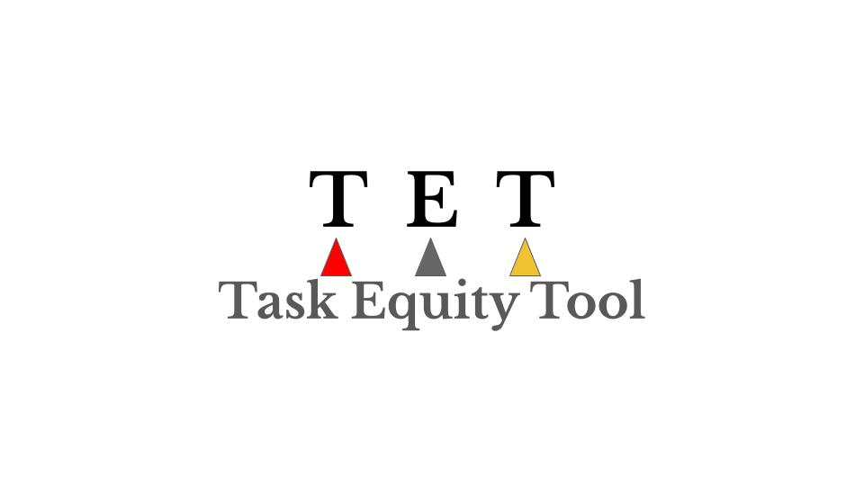

© France Lamontagne, Mai 2025. Cadre d'évaluation objective de la difficulté des tâches.
Méthodologie originale basée sur le principe du handicap au golf.
Tous droits réservés.

# CADRE D'ÉVALUATION OBJECTIVE DE LA DIFFICULTÉ DES TÂCHES

**Outil pratique pour mesurer objectivement la réelle difficulté de diverses tâches courantes** - faire le ménage, préparer les repas, s'occuper des enfants ou faire un potager. **Cette méthode se base sur des critères mesurables plutôt que sur des opinions ou des idées reçues.** Elle permet d'éviter que certains types de travaux soient automatiquement considérés comme "faciles" ou "naturels" alors qu'ils demandent parfois un effort considérable.

**L'objectif est de créer un système novateur et original d'évaluation des tâches basé sur le principe du "handicap" (similaire à celui du golf), où une même tâche peut recevoir une évaluation différente selon le contexte et la personne qui l'accomplit.**

**Pour mesurer cette difficulté, l'outil s'appuie sur quatre types de critères d'évaluation qui peuvent s'additionner selon les circonstances : effort physique, caractéristiques personnelles, facteurs environnementaux et contextuels.**

---

## LES TROIS PILIERS FONDAMENTAUX

Cette approche mesure toute tâche selon **trois indicateurs universels** :

### 🩹 1. DOULEUR (échelle 0-10)

| Niveau | Description | Exemple |
|--------|-------------|---------|
| **0** | Aucune douleur | - |
| **1-2** | Légère tension musculaire | Nettoyer fenêtres en hauteur |
| **3-4** | Douleur modérée | Désherber à genoux 1h |
| **5-6** | Douleur notable | Pelleter neige lourde |
| **7-8** | Douleur importante | Déplacer électroménagers |
| **9-10** | Douleur intense/risque blessure | Soulever seul un réfrigérateur |

 

### 😴 2. FATIGUE (échelle 0-10)
*Inclut fatigue physique, mentale, émotionnelle et stress*

| Niveau | Description | Exemple |
|--------|-------------|---------|
| **0** | Aucune fatigue | - |
| **1-2** | Légère fatigue | Préparer repas simple |
| **3-4** | Fatigue modérée | Lessive complète + étendage |
| **5-6** | Fatigue notable | Gérer crise familiale tout en cuisinant |
| **7-8** | Épuisement | S'occuper d'enfants malades 12h |
| **9-10** | Épuisement total | Organiser funérailles + gérer famille |

 

### 🔥 3. DÉPENSE CALORIQUE (échelle 0-10)
*Basée sur l'effort énergétique total réel, incluant temps rallongé par contraintes*

| Niveau | Calories | Description | Exemple |
|--------|----------|-------------|---------|
| **0** | 0-50 cal | Très léger | Plier du linge |
| **1-2** | 50-100 cal | Léger | Préparer sandwich |
| **3-4** | 100-200 cal | Modéré-léger | Faire vaisselle |
| **5** | 200-300 cal | Modéré | Passer aspirateur |
| **6-7** | 300-400 cal | Modéré-intense | Tondre pelouse |
| **8-9** | 400-500 cal | Intense | Pelleter neige |
| **10** | 500+ cal | Très intense | Déménagement |

---

## CRITÈRES D'ÉVALUATION OBJECTIVE

### FACTEURS LIÉS À L'EFFORT PHYSIQUE REQUIS PAR LA TÂCHE

**Les critères suivants sont évalués en référence à un adulte en santé de 30-40 ans (moyenne des deux sexes) dans des conditions normales. Cette base de référence permet ensuite de calculer le handicap spécifique à chaque personne selon ses caractéristiques personnelles.**

• **Dépense énergétique mesurable (calories)** : Mesure de l'énergie physique nécessaire pour accomplir la tâche. Ce calcul peut se faire en estimant les calories brûlées par heure d'activité selon des tables standardisées, ou en utilisant un moniteur cardiaque pour mesurer l'intensité réelle de l'effort. Par exemple, faire 2-3 brassées de lavage avec laveuse-sécheuse au sous-sol (incluant les multiples allers-retours dans les escaliers, le pliage et le rangement des draps pour 2 lits) brûle environ 200-250 calories pour notre personne de référence.

• **Micro-mouvements répétitifs** : Accumulation de petits gestes répétés qui causent fatigue musculaire et usure des articulations. Ces mouvements semblent anodins individuellement, mais leur répétition constante crée une charge physique significative souvent ignorée. Par exemple, éplucher 10 livres de pommes de terre implique des centaines de mouvements de poignet et de doigts qui peuvent causer crampes, douleurs articulaires et fatigue des avant-bras.

• **Effort soutenu requis** : Mesure du temps d'effort continu (physique et/ou mental) nécessaire sans pause naturelle intégrée à la tâche. Cet effort soutenu épuise les ressources car il ne permet pas de récupération progressive pendant l'exécution. Les tâches avec effort soutenu demandent une vigilance, concentration ou activité physique constante. Par exemple, surveiller des enfants en bas âge exige une attention mentale continue pendant des heures, tandis que le travail à la chaîne demande des gestes physiques répétitifs sans interruption.

• **Degré d'inconfort physique** : Évaluation des positions contraignantes maintenues pendant l'exécution de la tâche. Les positions contraignantes incluent celles qui forcent le corps dans des configurations non-naturelles (cou en hyperextension, dos courbé sans appui) ou qui compriment la circulation sanguine (agenouillé prolongé, accroupi dans un espace restreint). Par exemple, réparer ou nettoyer sous l'évier oblige à se contorsionner dans un espace minuscule, le dos courbé, la tête coincée contre la tuyauterie, position qu'il faut maintenir longtemps.

• **Ratio temps/interruptions** : Impact des interruptions sur l'effort total requis pour accomplir la tâche. Les interruptions forcent à recommencer mentalement, retrouver le rythme et parfois refaire certaines étapes, multipliant l'effort initial. Une tâche qui devrait prendre 30 minutes peut en exiger 60 si elle est constamment interrompue. Par exemple, préparer un repas complexe tout en répondant aux besoins des enfants transforme une recette de 45 minutes en marathon de 2 heures, avec stress supplémentaire de gérer les priorités concurrentes.

• **Charge mentale** : Planification, coordination et anticipation nécessaires pour accomplir la tâche avec succès. Cette charge cognitive invisible accompagne souvent les tâches physiques et peut être plus épuisante que l'effort physique lui-même. Elle implique de jongler mentalement avec multiples variables, échéanciers et imprévus. Par exemple, organiser les activités scolaires et parascolaires des enfants en tenant compte des rendez-vous médicaux et dentaires de toute la famille demande une gymnastique mentale constante : mémoriser les horaires, anticiper les conflits, prévoir les transports, et faire les ajustements lors d'imprévus.

---

### CARACTÉRISTIQUES PERSONNELLES

Cette section évalue les facteurs individuels qui influencent la capacité d'une personne à accomplir une tâche donnée. Ces caractéristiques permettent de personnaliser l'évaluation en tenant compte des spécificités de chaque individu.

**1. Conditions de santé physique**
*(cardio, arthrite, diabète, hypertension, troubles neurologiques, etc.)*

Mesure l'impact des conditions médicales physiques sur la capacité d'accomplir des tâches. Ces conditions peuvent affecter l'endurance, la mobilité, la dextérité ou d'autres aspects physiques nécessaires à l'exécution de certaines activités.

**2. Conditions de santé mentale et neurologique**
*(dépression, anxiété, TDAH, troubles bipolaires, PTSD, troubles alimentaires, dyslexie, dyspraxie, etc.)*

Évalue l'influence des conditions de santé mentale et neurologiques sur l'effort requis pour accomplir une tâche. Ces conditions peuvent affecter la concentration, l'énergie, la motivation, la gestion du stress, la capacité de prise de décision ou l'organisation, influençant directement la charge que représente une activité donnée.

**3. Caractéristiques physiques**
*(âge, taille, poids, force, mobilité, endurance)*

Regroupe les caractéristiques physiques mesurables qui influencent directement la capacité d'exécution des tâches. Ces facteurs déterminent les limites et capacités physiques de base de l'individu pour différents types d'efforts.

**4. Handicaps et limitations physiques**
*(moteurs et sensoriels : paralysie, amputation, cécité, surdité, blessures temporaires, etc.)*

Catégorie spécifique aux limitations physiques permanentes ou temporaires qui modifient significativement la façon d'accomplir les tâches ou qui nécessitent des adaptations particulières. Ces handicaps peuvent multiplier considérablement l'effort requis pour des activités considérées comme simples pour la population générale.

**5. Expérience/compétences**
*(novice vs expert dans le domaine de la tâche)*

Évalue le niveau de maîtrise et d'expérience de la personne dans le type de tâche à accomplir. L'expertise transforme radicalement l'effort requis : une tâche complexe pour un novice devient routinière pour un expert, réduisant à la fois la charge mentale et le temps nécessaire.

**6. Sexe biologique**

Cette catégorie capture uniquement les différences de métabolisme de base entre hommes et femmes, toutes autres variables étant égales (poids, taille, âge, conditions de santé). À caractéristiques physiques identiques, les hommes ont un métabolisme de base légèrement plus élevé en raison d'une composition corporelle différente (ratio muscle/graisse). Cette différence métabolique représente environ 10-15% d'écart calorique et constitue le SEUL facteur où le sexe biologique influence directement l'effort énergétique requis pour une tâche donnée.

Toutes les autres dimensions - charge mentale, compétences, stress physiologique, contexte social, expérience - sont évaluées séparément dans d'autres catégories de cet outil, car elles ne dépendent pas du sexe biologique mais de facteurs individuels, sociaux ou acquis. Cette distinction méthodologique évite de perpétuer des stéréotypes tout en préservant la rigueur scientifique dans l'évaluation des différences métaboliques réelles.

**Note importante :** Cet outil évalue uniquement les facteurs physiologiques et métaboliques objectifs liés à l'accomplissement de tâches. Les catégories utilisées (sexe biologique, caractéristiques physiques, etc.) ne constituent aucun jugement de valeur sur l'identité de genre, l'orientation sexuelle ou la valeur des personnes LGBTQ+. Toute personne, quelle que soit son identité de genre ou son orientation, peut utiliser cet outil en sélectionnant les caractéristiques biologiques/physiologiques qui correspondent à sa situation actuelle pour obtenir une évaluation précise de l'effort requis.

---

### FACTEURS ENVIRONNEMENTAUX

• **Conditions météorologiques** : Impact des conditions climatiques sur l'effort requis. Les températures extrêmes augmentent la dépense énergétique, le corps devant maintenir sa température interne. L'humidité élevée cause un épuisement plus rapide. Les précipitations compliquent la manipulation des outils. Le vent fort déstabilise l'équilibre et augmente les pertes caloriques. Par exemple, pelleter de la neige par -20°C avec vent fort multiplie considérablement l'effort par rapport aux mêmes conditions par temps calme.

• **Conditions du terrain et accessibilité** : Caractéristiques physiques de l'environnement qui influencent l'efficacité des mouvements. Les terrains en pente, l'instabilité du sol et les obstacles répétés augmentent l'effort et la dépense musculaire en obligeant le corps à compenser constamment. La distance des ressources transforme chaque outil oublié en déplacement supplémentaire. Par exemple, jardiner sur terrain en pente avec outils remisés à 200 mètres peut doubler l'effort par rapport à un terrain plat avec remise adjacente.

• **Qualité des outils disponibles** : État et adaptation des équipements utilisés, facteur crucial dans l'effort total requis. Des outils mal entretenus exigent une force supplémentaire et augmentent les risques de blessure. L'inadaptation à la morphologie de l'utilisateur cause tensions musculaires et fatigue prématurée. Par exemple, couper du bois avec une scie manuelle émoussée versus une scie électrique peut représenter 10 fois plus d'effort pour le même résultat.

• **Présence d'infrastructures de soutien** : Disponibilité des services de base qui facilitent l'exécution des tâches. L'absence d'eau courante oblige à transporter l'eau nécessaire, ajoutant poids et déplacements. Le manque d'électricité élimine les outils motorisés et limite les heures productives. L'absence de surfaces de travail appropriées oblige à improviser des solutions précaires. Par exemple, préparer un repas sans plan de travail ni évier transforme une tâche de 30 minutes en épreuve de 2 heures.

• **Obligation de porter des vêtements spécifiques** : Contrainte de porter des équipements ou vêtements particuliers qui modifient l'effort physique requis. Ces obligations peuvent être sécuritaires (casque, bottes, gants de protection), professionnelles (uniformes contraignants), religieuses (hijab, habits longs) ou climatiques (vêtements d'hiver lourds). Ces vêtements peuvent limiter la mobilité, augmenter la charge thermique ou entraver certains mouvements, multipliant l'effort par rapport à la même tâche en vêtements libres. Par exemple, le bûcheronnage en hiver avec équipement de protection complet demande un effort considérablement supérieur au même travail en été avec vêtements légers.

---

### FACTEURS CONTEXTUELS

• **Niveau de risque et conséquences d'erreur** : Probabilité d'accidents et gravité des erreurs possibles pendant la tâche obligent à prendre des mesures de précaution qui allongent la durée et l'effort total, tout en créant une pression psychologique constante. Par exemple, monter sur le toit pour réparer une gouttière nécessite de vérifier chaque tuile, éviter les fils électriques, porter un équipement de sécurité, multipliant le temps et l'effort par rapport à une réparation similaire au sol.

• **Présence de ressources humaines de soutien** : Disponibilité d'aide en cas de besoin ou d'urgence. Cette présence réduit significativement le stress et la charge mentale, sachant qu'un soutien est accessible. L'isolement complet multiplie l'effort car la personne doit anticiper tous les problèmes possibles sans filet de sécurité. Par exemple, le personnel en service de garde familial porte seul toute la responsabilité, contrairement au personnel en CPE qui peut compter sur la présence de collègues.

• **Visibilité et reconnaissance sociale** : Impact psychologique de la valorisation ou dévalorisation de la tâche par l'entourage. Les tâches invisibles ou considérées comme "normales" demandent plus d'effort mental car elles ne procurent pas de satisfaction externe pour compenser la fatigue. L'absence de reconnaissance épuise la motivation et augmente la charge émotionnelle. Par exemple, maintenir une maison impeccable quotidiennement devient plus lourd quand personne ne remarque l'effort, comparé à organiser un événement spécial qui sera apprécié.

• **Contraintes de temps** : Échéanciers rigides qui limitent la flexibilité d'exécution. Les délais serrés augmentent le stress et forcent un rythme soutenu sans possibilité de pause naturelle. L'impossibilité de reporter la tâche élimine la gestion personnelle de l'énergie et peut forcer à travailler dans de mauvaises conditions. Par exemple, planter les plants de brocolis dans un champ commercial avant l'arrivée de la pluie oblige les ouvriers agricoles à travailler jusqu'à minuit au-delà de leur journée de 10 heures, contrairement à planter ses 6 plants de brocolis personnels à son rythme.

---

## MÉTHODOLOGIE D'APPLICATION

### Principe innovateur
**Chaque facteur d'évaluation se traduit directement par son impact sur les trois piliers fondamentaux :**
- Impact sur la DOULEUR (0-10)
- Impact sur la FATIGUE (0-10) 
- Impact sur la DÉPENSE CALORIQUE (0-10)

### Calcul du score final
**Score = Handicap de base personnel + Impact spécifique de la tâche**

**1. Handicap de base personnel** : Addition des impacts de toutes les caractéristiques personnelles sur les 3 piliers

**2. Impact spécifique de la tâche** : Addition des impacts de tous les facteurs liés à cette tâche particulière

**3. Score final** : Les trois scores sont conservés séparément pour donner un profil complet de l'effort requis

---

## PROTOCOLE D'ÉVALUATION POUR SPÉCIALISTES ET SYSTÈMES IA

### 📝 Phase 1 : Définition de la tâche

**Le spécialiste/IA identifie** la tâche spécifique à évaluer en posant des questions précises :

#### Questions clés à poser :
- **Décrivez exactement la tâche à accomplir**
- **Dans quelles conditions cette tâche sera-t-elle effectuée ?** (moment, lieu, contexte)
- **Quels équipements/outils seront disponibles ?**
- **Y a-t-il des contraintes particulières ?**

#### ✅ Exemple de définition précise :
> **"Préparer le souper pour 4 personnes un mardi soir, cuisine équipée, ingrédients disponibles, enfants présents, une personne allergique aux arachides"**

---

### 👤 Phase 2 : Évaluation du profil personnel

**Le spécialiste/IA collecte** les informations sur les caractéristiques individuelles via questionnaire structuré :

#### 🏥 Santé physique
- **Avez-vous des conditions médicales diagnostiquées ?**
- **Prenez-vous des médicaments qui affectent votre énergie/mobilité ?**
- **Ressentez-vous des douleurs chroniques ?**

#### 🧠 Santé mentale et neurologique
- **Avez-vous reçu un diagnostic d'anxiété, dépression ou autre condition ?**
- **Avez-vous reçu un diagnostic de dyslexie, TDAH, dyspraxie ou autre difficulté d'apprentissage ?**
- **Ces conditions affectent-elles votre niveau d'énergie mental ou votre capacité d'organisation ?**

#### 💪 Caractéristiques physiques
- **Données objectives :** Âge, taille, poids
- **Auto-évaluation :** Évaluez votre force/endurance sur une échelle de 1 à 10

#### ♿ Handicaps et limitations physiques
- **Avez-vous des limitations physiques permanentes ou temporaires ?**
- **Utilisez-vous des aides techniques ?**
- **Avez-vous des blessures récentes ou en cours de guérison ?**

#### 🎯 Expérience
- **Depuis combien de temps pratiquez-vous ce type de tâche ?**
- **Vous considérez-vous novice, intermédiaire ou expert ?**

> **📊 Le système attribue automatiquement** les scores de 0 à 0.5 selon les réponses et calcule le **handicap de base**.

---

### ⚙️ Phase 3 : Analyse des facteurs spécifiques à la tâche

**Le spécialiste/IA évalue** chaque catégorie de facteurs en déterminant leur impact sur les 3 piliers :

#### 💪 Effort physique - Questions d'évaluation
- **Cette tâche nécessite-t-elle un effort cardiovasculaire soutenu ?**
- **Y a-t-il des mouvements répétitifs à effectuer ?**
- **La tâche exige-t-elle de maintenir des positions inconfortables ?**
- **La personne sera-t-elle interrompue pendant l'exécution ?**
- **Quel niveau de planification/coordination cette tâche demande-t-elle ?**

#### 🌍 Facteurs environnementaux - Observations
- **Conditions météorologiques** du moment
- **État du terrain/espace** de travail
- **Qualité et adaptation** des outils disponibles
- **Présence d'infrastructures** (eau, électricité, surfaces)
- **Obligations vestimentaires** particulières

#### 📋 Facteurs contextuels - Évaluation
- **Niveau de risque** associé à la tâche
- **Gravité des conséquences** en cas d'erreur
- **Disponibilité d'aide** en cas de besoin
- **Reconnaissance sociale** de cette tâche
- **Contraintes temporelles** imposées

---

### ⏱️ Phase 3 bis : Évaluation temporelle

**Questions IA supplémentaires :**
- **Combien de temps cette tâche prendra-t-elle dans ces conditions spécifiques ?**
- **Y aura-t-il des interruptions prévues ?** (enfants, téléphone, etc.)
- **Les outils/conditions rallongeront-ils le travail ?**

#### 📊 Calcul automatique
1. **Temps de base** (tâche en conditions normales)
2. **Multiplicateurs :**
   - Interruptions : ×1.5 à ×3
   - Outils inadéquats : ×1.3 à ×2  
   - Contraintes environnementales : ×1.2 à ×2
   - Handicaps personnels : ×1.2 à ×2
3. **Temps réel estimé** = base × multiplicateurs
4. **Calories finales** = calories/heure × temps réel

---

### 🤖 Phase 4 : Calcul automatisé et interprétation

**Le système IA :**
1. **Additionne** handicap de base + impact tâche pour chaque pilier
2. **Génère** les trois scores finaux (Douleur, Fatigue, Calories)
3. **Produit** un rapport avec recommandations

#### 📋 Exemple de rapport automatisé

**ÉVALUATION :** Vider 3 bacs de compostage

**PERSONNE :** Femme, 70 ans, problème genou, terrain 5 acres

**HANDICAP DE BASE :** Douleur/Fatigue 2.6, Calories 2.8

**IMPACT TÂCHE :** Douleur 5.0, Fatigue 6.0, Calories 4.0

**SCORES FINAUX :** Douleur 7.6/10, Fatigue 8.6/10, Calories 6.8/10

**RECOMMANDATIONS :**
- Diviser en plusieurs étapes
- Assistance recommandée
- Prévoir récupération prolongée

---

### 💡 Phase 5 : Recommandations contextualisées

**Le spécialiste/IA formule** des suggestions basées sur les scores :

| Scores | Niveau | Recommandations |
|--------|--------|-----------------|
| **7-10** | 🔴 **Élevé** | Délégation ou adaptation majeure recommandée |
| **4-6** | 🟡 **Modéré** | Planification et précautions nécessaires |
| **1-3** | 🟢 **Faible** | Tâche gérable avec planification normale |

---

### 💻 Applications technologiques

#### 🤖 Pour IA/Applications
- **Base de données** de tâches pré-évaluées
- **Algorithmes d'adaptation** selon profil utilisateur
- **Interface** de questions guidées
- **Calculs automatisés** en temps réel
- **Rapports personnalisés** avec recommandations

#### 👨‍⚕️ Pour spécialistes
- **Protocole d'entrevue** standardisé
- **Grilles d'évaluation** structurées
- **Outils de calcul** assisté
- **Rapports professionnels** normalisés

---

## EXEMPLES D'APPLICATION

### Exemple 1 : Vermicompostage

> **👤 PROFIL :** Femme de 70 ans avec problème de genou, vivant en autonomie dans une maison à 15-16°C, gestion d'un terrain de 5 acres.

#### 📊 Handicap de base calculé

**Douleur/Fatigue** : 2.6
- Âge (70 ans) : +0.5
- Problème de genou : +0.4
- Maison à 15-16°C : +0.3
- Grand terrain isolé : +0.3
- Absence d'équipements modernes : +0.3
- Autosuffisance complète : +0.4
- Responsabilités animales : +0.2
- Travail supplémentaire : +0.2

**Calories** : 2.8 (même calcul + sexe femme : +0.2)

#### 🎯 Tâche évaluée : Vider 3 bacs de compostage (25kg chacun)

| Pilier | Handicap de base | Impact tâche | **Score final** |
|--------|------------------|--------------|-----------------|
| 🩹 **Douleur** | 2.6 | +5.0 | **7.6/10** |
| 😴 **Fatigue** | 2.6 | +6.0 | **8.6/10** |
| 🔥 **Calories** | 2.8 | +4.0 | **6.8/10** |

> **⚠️ RECOMMANDATION :** Scores élevés - diviser en plusieurs étapes, demander assistance, prévoir récupération prolongée.

### Exemple 2 : Éducatrice en CPE

> **👤 PROFIL :** Femme 33 ans, douleurs dos, mère monoparentale 2 enfants, fumeuse

#### 📊 Handicap de base calculé

**Douleur/Fatigue** : 0.9
- Âge 33 ans : 0
- Douleurs dos : +0.3
- Mère monoparentale : +0.4
- Fumeuse : +0.2

**Calories** : 1.1 (même calcul + sexe femme : +0.2)

#### 🎯 Tâche évaluée : Gérer crise enfant + surveiller 9 autres (2-3 ans)

| Pilier | Handicap de base | Impact tâche | **Score final** |
|--------|------------------|--------------|-----------------|
| 🩹 **Douleur** | 0.9 | +3.0 | **3.9/10** |
| 😴 **Fatigue** | 0.9 | +10.0 | **9.9/10** |
| 🔥 **Calories** | 1.1 | +3.0 | **4.1/10** |

> **⚠️ RECOMMANDATION :** Fatigue critique - pause obligatoire, soutien collègues, rotation des responsabilités.

### Exemple 3 : Homme amputé

> **👤 PROFIL :** Homme 66 ans, amputation bras gauche, bonne santé

#### 📊 Handicap de base calculé

**Tous les piliers** : 0.9
- Âge 66 ans : +0.4
- Sexe homme : 0 (aucun impact métabolique significatif)
- Amputation bras gauche : +0.5
- Bonne santé : 0

#### 🎯 Tâche évaluée : Faire son ménage complet

| Pilier | Handicap de base | Impact tâche | **Score final** |
|--------|------------------|--------------|-----------------|
| 🩹 **Douleur** | 0.9 | +3.0 | **3.9/10** |
| 😴 **Fatigue** | 0.9 | +6.0 | **6.9/10** |
| 🔥 **Calories** | 0.9 | +4.0 | **4.9/10** |

> **💡 RECOMMANDATION :** Scores modérés - planification nécessaire, adapter les outils, prendre pauses régulières.

---

## APPLICATIONS ET BÉNÉFICES

Cette méthode d'évaluation permet de :

1. **Reconnaître objectivement** la difficulté réelle des tâches traditionnellement minimisées
2. **Adapter les attentes** en fonction des capacités et contextes des personnes
3. **Distribuer plus équitablement** les responsabilités dans un groupe
4. **Évaluer plus justement** l'effort physique et mental dans différents types de travaux
5. **Quantifier scientifiquement** la charge émotionnelle et mentale souvent invisible
6. **Fournir des données objectives** pour les politiques de santé au travail et d'accessibilité

Cette approche contribue à valoriser l'ensemble des travaux nécessaires à la vie quotidienne, sans reproduire les hiérarchies traditionnelles basées sur le genre, la visibilité sociale ou d'autres facteurs culturellement biaisés.

**Note pour développeurs** : Cet outil peut être enrichi par l'ajout d'échelles validées comme le PSS (Perceived Stress Scale) pour la mesure du stress, moyennant l'acquisition des licences appropriées.
