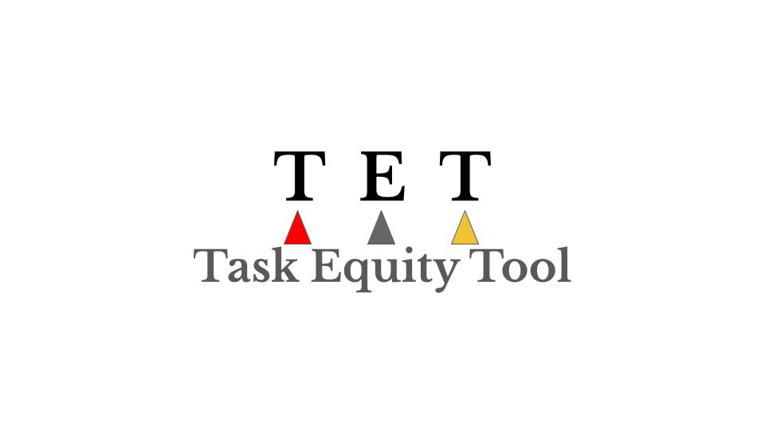

## 

 EXECUTIVE SUMMARY- Task Equity Tool™: Objective Evaluation System for Real Task Difficulty

### The $2 Trillion Hidden Problem

**The pandemic didn't create the workplace crisis—it exposed it.** Across North America, over 100 million workers have participated in the Great Resignation since 2021, with businesses losing $2+ trillion annually to absenteeism, turnover, and productivity loss. The root cause is the systematic **undervaluation of invisible tasks** that form the backbone of our economy.

**Current evaluation methods fail catastrophically.** Traditional job assessments ignore the hidden complexity of daily tasks—from managing household logistics while working remotely, to the physical toll of "simple" domestic work. These invisible tasks, predominantly performed by women and marginalized groups, are consistently rated as "easy" when they often require extraordinary effort.

**Post-pandemic workforce reality:** With reduced immigration, childcare shortages, and ongoing health impacts, fewer people do more work. Canadian job vacancy rates hit record 5.7% while 15% of workers report long COVID symptoms. In the US, 1.9 million workers are missing due to pandemic-related health issues. **The remaining workforce is overwhelmed, and traditional evaluation systems cannot measure their real burden.**

**The cost of ignorance is staggering:** 
- $300+ billion annually in burnout-related turnover (US alone)
- 40% productivity loss from unrecognized task complexity  
- 70% of healthcare workers report deteriorated mental health

**What's needed is revolutionary:** An objective, scientific system that captures the TRUE difficulty of any task while accounting for individual circumstances and environmental factors. A system that transforms invisible work into measurable, valuable data.

### Market Opportunity & Financial Impact

**The Task Equity Tool™ addresses a $50+ billion annual market across five high-value sectors:**

- 🏛️ **Government & Public Policy ($15B)** — Disability assessment, workplace safety, healthcare optimization
- 🏢 **Enterprise HR & Workforce Management ($20B)** — Fortune 500 retention, remote work management
- 🧠 **Healthcare & Mental Health Professionals ($8B)** — Occupational therapy, burnout treatment, rehabilitation
- 🤖 **AI/Tech Integration ($12B)** — HR software platforms, health apps, smart home systems
- 🎓 **Research & Academic Institutions ($3B)** — Universities, think tanks, government research

**Enterprise Savings (Per 1,000 employees):**
- Turnover reduction: $2.4M annually
- Productivity optimization: $1.8M annually  
- Reduced absenteeism: $900K annually
- Insurance premiums: $600K annually
- **Total projected savings: $5.7M per enterprise client**

### The Solution: Task Equity Tool™

**Revolutionary three-pillar assessment system** that objectively measures ANY task:

- 🩹 **Pain Scale (0-10)** — Physical discomfort, injury risk, bodily strain
- 😴 **Fatigue Scale (0-10)** — Mental, emotional, physical exhaustion
- 🔥 **Caloric Expenditure Scale (0-10)** — True energy cost including environmental constraints

**Breakthrough Innovation: Personal Handicap System™**
- Like golf handicaps, every individual gets a baseline score based on health, age, experience, circumstances
- Same task = different difficulty scores for different people

**Technology-Ready:** API integration, AI-powered automated assessments, real-time calculation, standardized protocols

**The opportunity is immediate.** Post-pandemic workforce crisis demands solutions NOW. Early adopters gain competitive advantage while solving urgent retention and productivity challenges.

**Investment needed:** $10M Series A for platform development, regulatory approval, and market penetration.

**Expected ROI for investors:** 20-50x return within 5 years based on comparable workforce technology exits.

### The Bottom Line
**The Task Equity Tool™ solves a $2 trillion problem while creating happier, more productive workforces.** **Early investors gain access to a revolutionary technology that transforms invisible work into measurable value.** **The post-pandemic world demands this solution—now.**
